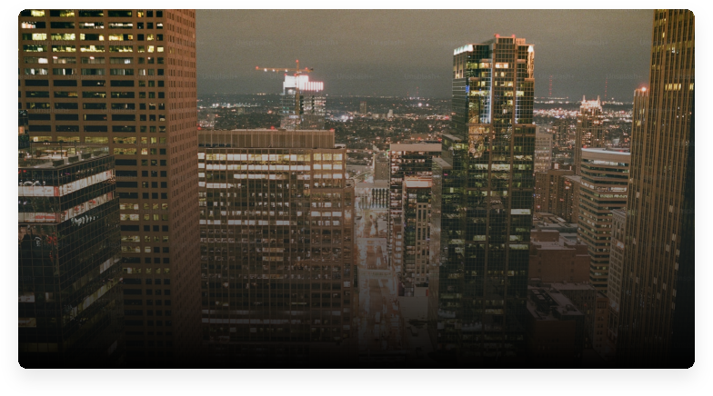
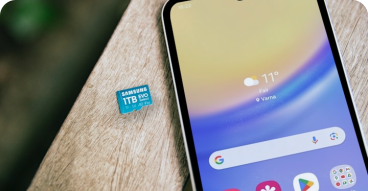

# The Dev News - API Documentation

## Table of Contents
1. [Project Overview](#project-overview)
2. [HTML Components](#html-components)
3. [CSS Utilities & Classes](#css-utilities--classes)
4. [Layout System](#layout-system)
5. [Responsive Design](#responsive-design)
6. [Typography System](#typography-system)
7. [Color Palette](#color-palette)
8. [Usage Examples](#usage-examples)

## Project Overview

**The Dev News** is a responsive blog website built with semantic HTML5 and CSS3. The project features a modern, mobile-first design that adapts seamlessly across devices (smartphone, tablet, desktop, ultrawide monitors).

### Key Features
- Responsive grid layout
- Mobile-first design approach
- Semantic HTML structure
- Component-based CSS architecture
- SVG image optimization

### Technologies Used
- HTML5
- CSS3 (Grid, Flexbox, Media Queries)
- Google Fonts (Montserrat)
- SVG Graphics

---

## HTML Components

### 1. Header Component

**Purpose:** Main site navigation and branding

**Structure:**
```html
<header>
    <div id="container-header">
        <h1 id="header-title">The Dev News</h1>
    </div>
</header>
```

**API:**
- `#container-header`: Main container with max-width constraint
- `#header-title`: Site title with brand styling

**Usage:**
```html
<!-- Basic header implementation -->
<header>
    <div id="container-header">
        <h1 id="header-title">Your Site Name</h1>
    </div>
</header>
```

---

### 2. Main Post Component

**Purpose:** Featured article display with overlay content

**Structure:**
```html
<section id="main-post">
    <article id="main-post-article">
        
        <div id="main-post-content">
            <span id="category">category-name</span>
            <h2>Article Title</h2>
            <p>By Author Name</p>
        </div>
    </article>
</section>
```

**API:**
- `#main-post`: Container with fixed height (25rem)
- `#main-post-article`: Relative positioned article wrapper
- `#main-post-content`: Absolutely positioned overlay content

**Properties:**
- Height: 25rem (mobile: 15.5rem)
- Border radius: 0.75rem
- Overlay positioning: bottom-left

**Usage Example:**
```html
<section id="main-post">
    <article id="main-post-article">
        
        <div id="main-post-content">
            <span id="category">tecnologia</span>
            <h2>Como implementar componentes reutilizáveis</h2>
            <p>By João Silva</p>
        </div>
    </article>
</section>
```

---

### 3. Recent Posts Component

**Purpose:** Grid layout for displaying recent blog posts

**Structure:**
```html
<section id="recent-posts">
    <div id="recent-posts-header">
        <h3 class="title-sections">Posts mais recentes</h3>
        <a href="#">Ver todos</a>
    </div>
    <div id="recent-posts-container">
        <!-- Card components here -->
    </div>
</section>
```

**API:**
- `#recent-posts`: Main container
- `#recent-posts-header`: Header with title and "view all" link
- `#recent-posts-container`: Grid container for cards
- `.title-sections`: Header title styling

**Grid Behavior:**
- Desktop: 2 columns
- Tablet: 2 columns  
- Mobile: 1 column

---

### 4. Recent Post Card Component

**Purpose:** Individual post card with image and content

**Structure:**
```html
<div class="card-recents-container">
    <div class="card-recents-content-img">
        
    </div>
    <div class="card-recents-content">
        <p class="card-recents-badge">category</p>
        <h2 class="card-recents-title">Post Title</h2>
        <p class="author-text"><strong>By </strong>Author Name</p>
        <p class="card-recents-info">Post description...</p>
        <p class="date">22 Agosto 2022</p>
    </div>
</div>
```

**API Classes:**
- `.card-recents-container`: Main card wrapper
- `.card-recents-content-img`: Image container (12rem height)
- `.card-recents-img`: Responsive image
- `.card-recents-content`: Content container (13rem height)
- `.card-recents-badge`: Category badge
- `.card-recents-title`: Post title
- `.card-recents-info`: Post excerpt
- `.author-text`: Author information
- `.date`: Publication date

**Card Dimensions:**
- Image height: 12rem
- Content height: 13rem
- Min width: 16rem
- Border radius: 0.75rem
- Box shadow: 0px 0.25rem 0.25rem rgba(0, 0, 0, 0.1)

---

### 5. Popular Posts Component

**Purpose:** Sidebar component for popular content

**Structure:**
```html
<section id="popular-posts">
    <div id="popular-posts-header">
        <h3 class="titles-sections-sidebar">Posts populares</h3>
    </div>
    <!-- Card containers -->
</section>
```

**API:**
- `#popular-posts`: Main container
- `#popular-posts-header`: Section header
- `.titles-sections-sidebar`: Sidebar title styling

---

### 6. Popular Post Card Component

**Purpose:** Compact horizontal card for popular posts

**Structure:**
```html
<div class="card-popular-container">
    <div class="card-popular-content-img">
        
    </div>
    <div class="card-popular-content">
        <h2 class="card-popular-title">Post Title</h2>
        <p class="date">22 Agosto 2022</p>
    </div>
</div>
```

**API Classes:**
- `.card-popular-container`: Horizontal flex container (6rem height)
- `.card-popular-content-img`: Image container (8rem width × 4.5rem height)
- `.card-popular-img`: Responsive image
- `.card-popular-content`: Text content container
- `.card-popular-title`: Post title (0.875rem font)

---

### 7. Categories Component

**Purpose:** Sidebar navigation for content categories

**Structure:**
```html
<section id="categories">
    <div id="categories-header">
        <h3 class="titles-sections-sidebar">Categorias</h3>
    </div>
    <div class="card-categories-container">
        <p class="categories-text">></p>
        <span class="button-categories">category-name</span>
        <p class="categories-text2">(count)</p>
    </div>
</section>
```

**API Classes:**
- `#categories`: Main container
- `#categories-header`: Section header
- `.card-categories-container`: Individual category row
- `.categories-text`: Left arrow indicator
- `.button-categories`: Category name/button
- `.categories-text2`: Post count

---

### 8. Footer Component

**Purpose:** Site footer with copyright information

**Structure:**
```html
<footer>
    <div id="container-footer">
        <p>Copyright@The Dev News</p>
    </div>
</footer>
```

**API:**
- `#container-footer`: Footer content container

---

## CSS Utilities & Classes

### Layout Classes

#### Container Classes
```css
#container-header    /* Header content wrapper */
#container-footer    /* Footer content wrapper */
```

#### Grid Systems
```css
#recent-posts-container {
    display: grid;
    grid-template-columns: 1fr 1fr;  /* 2 columns on desktop */
    gap: 1.5rem;
}
```

### Typography Classes

#### Headings
```css
.title-sections          /* Main section titles (1.5rem) */
.titles-sections-sidebar /* Sidebar section titles (1.5rem) */
.card-recents-title      /* Card titles (1.25rem) */
.card-popular-title      /* Popular card titles (0.875rem) */
```

#### Text Classes
```css
.author-text            /* Author information styling */
.card-recents-info      /* Post excerpt text */
.card-recents-badge     /* Category badges */
.date                   /* Date formatting */
.categories-text        /* Category navigation text */
.button-categories      /* Category button styling */
```

### Component Classes

#### Card Components
```css
.card-recents-container    /* Recent post cards */
.card-popular-container    /* Popular post cards */  
.card-categories-container /* Category navigation items */
```

#### Image Containers
```css
.card-recents-content-img  /* Recent post image containers */
.card-popular-content-img  /* Popular post image containers */
.card-recents-img         /* Recent post images */
.card-popular-img         /* Popular post images */
```

---

## Layout System

### Main Layout Structure

The site uses CSS Grid for the main layout:

```css
main {
    display: grid;
    grid-template-columns: 3fr 1fr;  /* Content : Sidebar = 3:1 ratio */
    max-width: 90rem;
    margin: 3.5rem auto;
    gap: 1.5rem;
}
```

**Breakpoint Behavior:**
- **Desktop (≥1024px):** 3:1 grid (content:sidebar)
- **Tablet (768px-1023px):** 1 column, sidebar becomes horizontal
- **Mobile (≤767px):** 1 column, sidebar stacks vertically

### Grid Specifications

#### Recent Posts Grid
```css
#recent-posts-container {
    display: grid;
    grid-template-columns: 1fr 1fr;  /* 2 columns */
    gap: 1.5rem;
}

/* Mobile override */
@media screen and (max-width: 767px) {
    #recent-posts-container {
        grid-template-columns: 1fr;  /* 1 column */
    }
}
```

---

## Responsive Design

### Breakpoints

The project uses three main breakpoints:

1. **Mobile:** ≤767px
2. **Tablet:** 768px - 1023px  
3. **Desktop:** ≥1024px

### Responsive Behavior

#### Mobile (≤767px)
```css
@media screen and (max-width: 767px) {
    html { font-size: 0.75rem; }              /* Smaller base font */
    main { grid-template-columns: 1fr; }       /* Single column */
    #main-post { height: 15.5rem; }           /* Reduced height */
    #recent-posts-container { 
        grid-template-columns: 1fr; 
    }                                          /* Single column cards */
    aside { 
        display: flex;
        flex-direction: column;
        gap: 1.5rem;
    }                                          /* Stacked sidebar */
}
```

#### Tablet (768px-1023px)
```css
@media screen and (min-width: 768px) and (max-width: 1023px) {
    main { grid-template-columns: 1fr; }       /* Single column */
    aside { 
        display: flex;
        gap: 1.5rem;
    }                                          /* Horizontal sidebar */
}
```

### Responsive Image Guidelines

All images use responsive techniques:

```css
.card-recents-img,
.card-popular-img {
    width: 100%;
    height: 100%;
    object-fit: cover;
    border-radius: 0.75rem;
}
```

---

## Typography System

### Font Configuration

**Primary Font:** Montserrat (Google Fonts)
**Fallback:** sans-serif

```css
html {
    font-family: "Montserrat", sans-serif;
    font-size: 1rem;        /* Desktop base */
}

/* Mobile scaling */
@media screen and (max-width: 767px) {
    html { font-size: 0.75rem; }
}
```

### Font Scale

| Element | Desktop Size | Weight | Usage |
|---------|-------------|---------|--------|
| `#header-title` | 2.25rem | 700 | Main site title |
| `.title-sections` | 1.5rem | 700 | Section headers |
| `.card-recents-title` | 1.25rem | 700 | Card titles |
| `.author-text` | 1rem | 500 | Author information |
| `.card-recents-info` | 0.875rem | 400 | Body text |
| `.card-popular-title` | 0.875rem | 700 | Small card titles |
| `.date` | 0.875rem | 500 | Date stamps |

---

## Color Palette

### Primary Colors

```css
/* Primary Brand Color */
#02a28f    /* Teal - Headers, buttons, accents */

/* Text Colors */
#ffffff    /* White - Header text, overlay text */
#000000    /* Black - Primary text */
#616161    /* Gray - Secondary text, metadata */
```

### Usage Guidelines

#### Brand Color (#02a28f)
- Header backgrounds
- Section headers
- Category badges
- Links and accents

#### Text Hierarchy
- **Primary text:** #000000 (titles, main content)
- **Secondary text:** #616161 (dates, metadata, categories)
- **Overlay text:** #ffffff (on colored backgrounds)

### Color Application Examples

```css
/* Header styling */
header { background-color: #02a28f; }
#header-title { color: #ffffff; }

/* Category badge */
.card-recents-badge { color: #02a28f; }

/* Text hierarchy */
.card-recents-title { color: #000000; }
.author-text { color: #616161; }
.date { color: #616161; }
```

---

## Usage Examples

### Creating a New Blog Post Card

```html
<div class="card-recents-container">
    <div class="card-recents-content-img">
        
    </div>
    <div class="card-recents-content">
        <p class="card-recents-badge">javascript</p>
        <h2 class="card-recents-title">Introdução ao React Hooks</h2>
        <p class="author-text"><strong>By </strong>Maria Santos</p>
        <p class="card-recents-info">
            Aprenda os conceitos fundamentais dos React Hooks e como eles 
            podem simplificar o desenvolvimento de componentes funcionais.
        </p>
        <p class="date">15 Janeiro 2024</p>
    </div>
</div>
```

### Adding a New Category

```html
<div class="card-categories-container">
    <p class="categories-text">></p>
    <span class="button-categories">javascript</span>
    <p class="categories-text2">(5)</p>
</div>
```

### Creating a Popular Post

```html
<div class="card-popular-container">
    <div class="card-popular-content-img">
        
    </div>
    <div class="card-popular-content">
        <h2 class="card-popular-title">Tendências de Frontend 2024</h2>
        <p class="date">10 Janeiro 2024</p>
    </div>
</div>
```

### Customizing the Main Featured Post

```html
<section id="main-post">
    <article id="main-post-article">
        
        <div id="main-post-content">
            <span id="category">inteligência artificial</span>
            <h2>O Futuro da IA no Desenvolvimento Web</h2>
            <p>By Dr. Carlos Oliveira</p>
        </div>
    </article>
</section>
```

### Custom CSS Modifications

#### Changing the Brand Color
```css
/* Update all brand color instances */
header,
#recent-posts-header,
#popular-posts-header,
#categories-header {
    background-color: #your-brand-color;
}

.card-recents-badge {
    color: #your-brand-color;
}
```

#### Adjusting Card Spacing
```css
#recent-posts-container {
    gap: 2rem;  /* Increase gap between cards */
}

.card-recents-container {
    margin-top: 2rem;  /* Increase top margin */
}
```

#### Custom Typography
```css
html {
    font-family: "Your-Font", "Montserrat", sans-serif;
}

.card-recents-title {
    font-size: 1.5rem;  /* Larger card titles */
    font-weight: 600;
}
```

---

## Best Practices

### Image Optimization
- Use SVG for scalable graphics
- Maintain aspect ratios with `object-fit: cover`
- Always include descriptive `alt` attributes
- Optimize file sizes for web delivery

### Accessibility
- Use semantic HTML elements (`<header>`, `<main>`, `<aside>`, `<footer>`)
- Maintain proper heading hierarchy (h1 → h2 → h3)
- Ensure sufficient color contrast
- Include meaningful alt text for images

### Performance
- Use CSS Grid and Flexbox for layouts
- Minimize CSS specificity conflicts
- Leverage browser caching for Google Fonts
- Optimize image formats and sizes

### Responsive Design
- Follow mobile-first approach
- Test across multiple device sizes
- Use relative units (rem, %, vw/vh)
- Ensure touch targets are appropriately sized

---

## Browser Support

### Minimum Requirements
- CSS Grid support (IE11+, all modern browsers)
- Flexbox support (IE11+, all modern browsers)
- CSS Custom Properties for future enhancements
- SVG support (IE9+, all modern browsers)

### Tested Browsers
- Chrome 80+
- Firefox 75+
- Safari 13+
- Edge 80+
- Mobile Safari iOS 13+
- Chrome Mobile 80+

---

This documentation covers all public components, utilities, and patterns available in The Dev News blog project. For implementation questions or custom modifications, refer to the specific component sections and usage examples provided above.